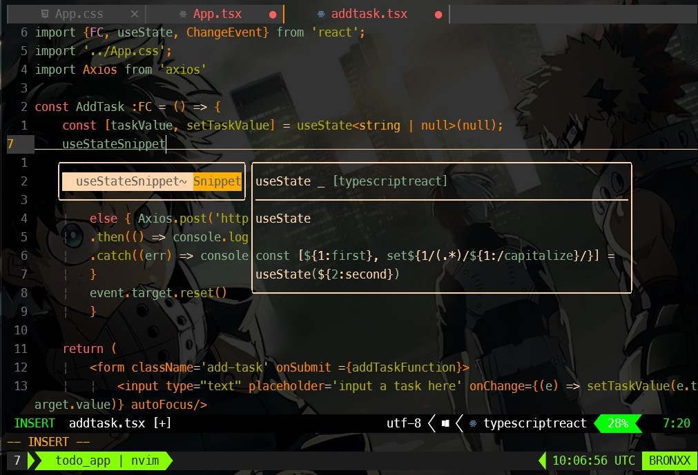
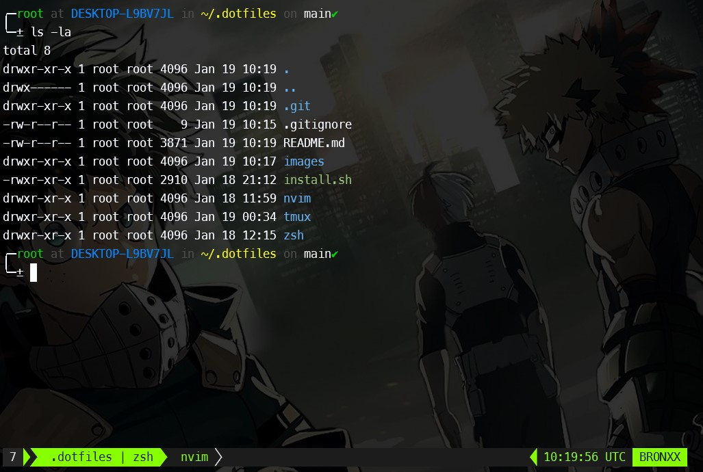

# My dotfiles

**warning**: Please do now not use settings if you have no idea what it contains. Use at your own risk!!

## contents

 - Neovim config
 - Zsh config
 - tmux config
 - install script

## Neovim setup
> This uses [neovim](https://neovim.io) version 0.8 and higher

My neovim config uses various plugins to make my workflow smooth

Plugins that i use:
  - [wbthomason/packer.nvim](https://github.com/wbthomason/packer.nvim) - Plugin manager
  - [nvim-lualine/lualine.nvim](https://github.com/nvim-lualine/lualine.nvim) - use to set statusline
- [gruvbox](https://www.github.com/mohertz/gruvbox) - this is the colorscheme that is use
- [nvim-tree](https://www.github.com/nvim-tree/nvim-tree.lua) -this is use for a directory
- [fzf](https://www.github.com/junegunn/fzf) - a fuzzy finder 
- [windwp/nvim-ts-autotag](https://www.github.com/windwp/nvim-ts-autotag) - use to auto close tags
- [romgrk/barbar](https://www.github.com/romgrk/barbar.nvim) - use to show tabs 
- [williamboman/mason](https://www.github.com/mason.nvim) - lsp
- [williamboman/mason-lspconfig.nvim](https://www.github.com/williamboman/mason=lsp-config.nvim) - used for lsp 
- [neovim/nvim-lspconfig](https://www.github.com/neovim/nvim-lspconfig)- use to configure neovim in-built lsp
- [harsh7th/nvim-cmp](https://www.github.com/harsh7th/nvim-cmp) - plugin for completion in-built lsp
- [harsh7th/cmp-nvim-lsp](https://www.github.com/harsh7th/cmp-nvim-lsp) - source for neovim lsp
- [L3M0N4D3/LuaSnip](https://www.github.com/L3M0N4D3/LuaSnip) - snippets engine
- [rafamadriz/friendly-snippets](https://www.github.com/rafamadriz/friendly-snippets) - search engine for snippets 
- [nvim-lua/telescope](https://www.github.com/nvim-lua/telescope) - highly customizable fuzzy finder 
- [nvim-lua/telescope.nvim](nvim-lua/telescope.nvim) - telescope
- [jremmen/vim-ripgrep](https://www.github.com/jremmen/vim-ripgrep) - telescope 
- [aca/emmet-ls](https://www.github.com/aca/emmet-ls) - emmet for html
- [iamcco/markdown-preview.nvim](https://www.github.com/iamcco/markdown-preview.nvim) A markdown live preview 
- [numToStr/Comment.nvim](https://www.github.com/numToStr/Comment.nvim) - use to comment 
- [nvim-autopairs](https://www.github.com/nvim-autopairs) - Autoparis
- [colorizer](https://www.github.com/colorizer) - a colour highlighter

### what i use to customize and work effectively in shell

 - [nerd-fonts](https://github.com/ryanoasis/nerd-fonts) - Powerline patch fonts. I use meslo font
 - [zsh](https://www.zsh.org/) -i use the zsh shell because it is flexible and highly customizable
 - [oh-my-zsh](https://github.com/ohmyzsh/ohmyzsh) -i use to oh-my-zsh to customize shell
 - [z](https://github.com/rupa/z) -i use z to jump around in shell
 - [tmux](https://tmux.github.io/) -i use tmux because it is very flexible and it helps to get work done fast. tmux spit a single window into multiple panes, enabling users to run multiple commands and processes at the same time. This can greatly increase productivity, as users are able to work on multiple tasks and projects simultaneously

## Installation

I create a simple bash script [install.sh](https://github.com/RajaeDev6/dotfiles/blob/main/install.sh "installation script") to install all packages that i use to setup my work environment, this script automatically configure all settings to neovim, tmux, zsh and everything that i use.

**Note!!** that this script is very messy and as i just learn bash and thought this was a good little project to do so i wouldn't reccommend using it. If you look it over and decides to use it. Use at you own risk.

### clone repo
---
    git clone https://github.com/yahoo100kkk/dotfiles.git
---
### run the install script 
---
    ./install.sh
---
### What this script will install
    
 1. Neovim
 1. tmux
 1. zsh
 1. oh-my-zsh
 1. unzip
 1. gzip

